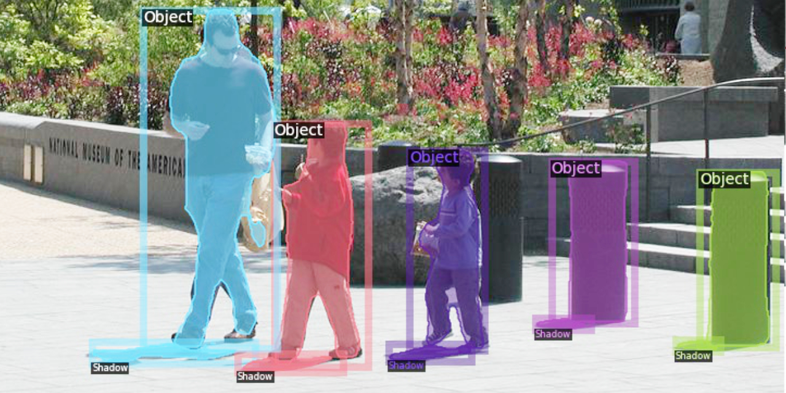

# Instance Shadow Detection (CVPR’ 20)

[Tianyu Wang](https://stevewongv.github.io)\*, [Xiaowei Hu](https://xw-hu.github.io)\*, Qiong Wang,  Pheng-Ann Heng,  and [Chi-Wing Fu](http://www.cse.cuhk.edu.hk/~cwfu/)
 (\* Joint first authors.)

[[`openaccess`](http://openaccess.thecvf.com/content_CVPR_2020/papers/Wang_Instance_Shadow_Detection_CVPR_2020_paper.pdf)][[`arXiv`](https://arxiv.org/abs/1911.07034)] [[`BibTeX`](#CitingLISA)]




Instance shadow detection aims to find shadow instances paired with object instances. We present a dataset, a deep framework, and an evaluation metric to approach this new task. This repo is implemented on [Detectron2](https://github.com/facebookresearch/detectron2).

## Dependences

* python>=3.6
* torch==1.3.0+cu100
* torchvision==0.4.1+cu100
* tensorboard
* cython
* jupyter
* scikit-image
* numpy
* opencv-python
* pycocotools


## Installation 

Install LISA and pysobatools

```bash
$ cd InstanceShadowDetection
$ python setup.py install
$ cd PythonAPI
$ python setup.py install
```

## Get Output
Please dowload "BDLISA.pth" from [Google Drive](https://drive.google.com/drive/folders/131w3lTvWfHsojrwbfBGEjZYENCg_4-UG?usp=sharing). Put the model in `projects/LISA/output_light/`. 
```bash
$ cd projects/LISA/
$ python test.py --input ./demo --config ./config/LISA_101_FPN_3x.yaml
```

## Train

```bash
$ python train_net.py --num-gpus 1 --config-file ./config/LISA_101_FPN_3x.yaml

```

## <a name="CitingLISA"></a> Citation
If you use LISA, SOBA, or SOAP, please use the following BibTeX entry.

```
@InProceedings{Wang_2020_CVPR,
author = {Wang, Tianyu and Hu, Xiaowei and Wang, Qiong and Heng, Pheng-Ann and Fu, Chi-Wing},
title = {Instance Shadow Detection},
booktitle = {IEEE/CVF Conference on Computer Vision and Pattern Recognition (CVPR)},
month = {June},
year = {2020}
}
```
